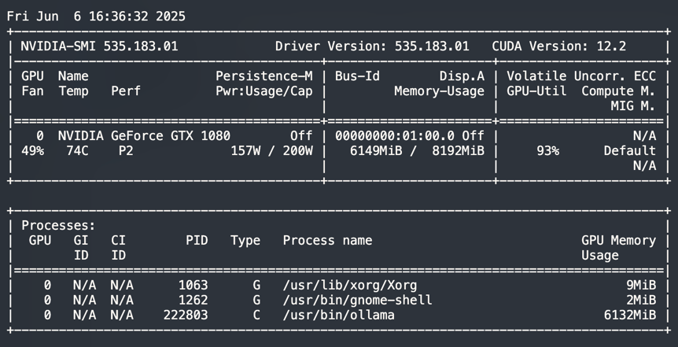

# 1. 技术方案

大概的方向就是先使用爬虫技术，爬取网站的新闻文本、图片，英文新闻使用机器翻译进行翻译，使用ollama中deepseek进行摘要提取，上述的素材准备好，使用moviepy生成视频。
主要用的技术：

- 爬虫：BeautifulSoup
- ~~机器翻译：字节旗下的[火山翻译](https://www.volcengine.com/docs/4640/65067)（每月有免费额度，不够用，已移除，使用deepseek翻译）~~ 
- 摘要提取：ollama 部署了  [deepseek-r1:8b](https://ollama.com/library/deepseek-r1 "点击打开ollama")
- 文字转语音:刚开始打算使用[字节的megaTTS](https://github.com/bytedance/MegaTTS3)，8G的显示不够，使用微软的edge-tts，效果还可以。
- 视频生成：moviepy


> 硬件最好是有GPU，用来运行ollama，当然可以用云服务器代替，取决于个人的资源。

# 2. 新闻来源

- [x] 中国日报（chinadaily）
- [x] 英国广播公司（BBC）
- [ ] 英国卫报（The Guardian）https://www.theguardian.com/us
- [ ] 泰晤士报（The Times） https://www.thetimes.com/
- [ ] 彭博社报 https://www.bloomberg.com/

英国卫报、泰晤士报、彭博社报和BBC的内容差不多，不再重复爬取。

# 3. 使用

在ubuntu 22.04 中，使用conda创建一个python3.11的环境，安装依赖包，然后运行crawl_news.py和vedio_generator.py。

> 要先使用python crawl_news.py，下载好的数据，再调用video_generator.py生成视频。

```shell
source activate py311
python crawl_news.py
python video_generator.py
# 支持日期的传入
python crawl_news.py 20250605
python vedio_generator.py 20250605
```

# 4. 效果

以下生成的视频截图


# 5. 测试

功能可用，在摘要生成时，以下的nvidia 1080 8G 显卡，在运行ollama deepseek-r1:8b进行摘要生成的情况：


# 6. todo

- [x] 英文翻译成中文
- [x] ollama进行摘要提取
- [ ] ~~ollama进行摘要提取后，增加一个小的评论~~
- [x] 信息的过滤，对于政治类的信息，中英文的都要去除
- [ ] 照片去重
- [x] 晚间新闻
- [ ] 重试入口
- [ ] 背景音乐
- [ ] 视频爬取
- [x] 内容过滤
- [x] 时长过多，要精简
- [x] 片头优化
- [ ] 自动上传B站
# 7. 附件

爬取的数据样例：

```json
[
  {
    "title": "【CHINA DAILY】【中国那些事儿】马来西亚专家：中国对多边主义的开放态度增强了全球南方国家的力量",
    "title_en": "[CHINA DAILY] [Those things in China] Malaysian expert: China's openness to multilateralism has strengthened the power of countries in the global South",
    "images": [
      "68410a5ca31020535fca5151.jpeg"
    ],
    "image_urls": [
      "https://img3.chinadaily.com.cn/images/202506/05/68410a5ca31020535fca5151.jpeg"
    ],
    "content_cn": "中国日报网6月5日电 马来西亚专家认为，中国坚定不移地维护全球自由贸易和多边合作，不仅促进了中国自身的增长，而且在全球不确定性不断增加的情况下，为“全球南方”国家的崛起贡献了力量。 马来西亚国际伊斯兰大学政治学博士李佩梅（Lee Pei May）日前在接受采访时表示，中国积极参与东盟－中国－海合会峰会有助于对冲某些国家愈演愈烈的保护主义和单边政策的消极影响，凸显了中国作为“经济稳定器”的作用。 5月27日，首届东盟－中国－海合会峰会在马来西亚吉隆坡召开。作为全球经济发展最具活力的三大经济实体，东盟、中国和海湾阿拉伯国家合作委员会的携手合作，不仅为各自繁荣注入强劲动力，推动全球跨区域互利共赢，更将有力维护“全球南方”国家共同利益，为亚洲乃至世界的发展贡献关键力量。 李佩梅指出，东盟－中国－海合会峰会为“全球南方”国家提供了发声的机会，使其能够借助这一平台讨论在全球不确定性中开展合作的新方式。她说，这也是“全球南方”国家努力重塑更具包容性和多样性的世界秩序的好机会。 李佩梅说：“峰会证明，各经济体之间可以互补而非竞争。”她认为，此次峰会对当下全球的保护主义和孤立主义趋势起到了抵制作用。 马来西亚泰莱大学国际关系专家朱莉娅·罗克尼法德（Julia Roknifard）指出，中国是东盟－海合会合作的支柱。 她指出：“通过各种基础设施、贸易和发展项目，特别是通过全球发展倡议引领下的共建‘一带一路’倡议，中国已经对东盟和包括海合会国家在内的广大中东地区产生了变革性影响。” 罗克尼法德补充说：“但三方的关系远不止于此，除了旅游和人文交流之外，中国还越来越多地参与到技术共享和工业化进程中。” 马来西亚国立大学马来西亚与国际研究所高级研究员甘佳谊（Andrew Kam Jia Yi）强调，在全球技术发展日益分裂的背景下，发展中国家之间有必要建立更务实、更具包容性的合作框架。",
    "content_en": null,
    "folder": "0000",
    "index_inner": 0,
    "index_show": 0,
    "url": "https://cn.chinadaily.com.cn/a/202506/05/WS68410343a310205377036856.html",
    "source": "chinadaily",
    "news_type": "国内新闻",
    "publish_time": null,
    "author": null,
    "tags": [],
    "summary": "马来西亚专家表示，中国在全球自由贸易和多边合作中发挥关键作用，不仅推动了自身经济增长，也支持“全球南方”国家的崛起。东盟-中国-海合会峰会在吉隆坡成功召开，凸显了中国作为“经济稳定器”的重要性，为各方提供了互补合作的平台，以对冲保护主义和孤立主义趋势。李佩梅指出，该峰会为“全球南方”国家发声的机会，使其能够借助新方式讨论合作，并重塑更具包容性和多样性的世界秩序。朱莉娅·罗克尼法德强调中国是三方合作的支柱，通过“一带一路”等倡议产生了变革性影响，涉及技术共享和工业化进程。甘佳谊则指出，在全球技术分裂背景下，发展中国家需要建立更务实、更具包容性的合作框架，以推动多边合作的未来发展。"
  },
  {
    "title": "【CHINA DAILY】国际经济协会秘书长：面对美关税战，东盟应选择战略性“脱钩”",
    "title_en": "[CHINA DAILY] Secretary General of the International Economic Association: Facing the US tariff war, ASEAN should choose strategic \"decoupling\"",
    "images": [
      "68418595a31020535fca595e.jpeg"
    ],
    "image_urls": [
      "https://img3.chinadaily.com.cn/images/202506/05/68418595a31020535fca595e.jpeg"
    ],
    "content_cn": "国际经济协会秘书长莉莉·扬·英6月5日在《中国日报》撰文称，应对美国政府发起的关税战，最明智的战略选择不是谈判或妥协，而是“有所不为”。东盟应当拒绝参加不对等谈判，从而更好地维护自身利益，并让美国为其保护主义行径买单。 美国加征关税破坏互利合作 文章指出，美国总统特朗普指责中国、日本、韩国、印度和东盟成员国“偷走工作机会”，这一说法显然有悖事实。2021年至2024年，美国平均失业率仅3.8%，处于发达国家中的最低水平，这足以戳穿亚洲经济体偷走美国就业岗位的谎言。事实上，美国2024年的国内生产总值（GDP）达到创纪录的29.3万亿美元，继续保持世界最大经济体的地位。 从美国的产业结构上看，服务业贡献了81%的GDP，吸纳了79%的劳动力，而制造业仅占据极小的就业份额。特朗普以“保就业”为名对亚洲国家产品征收关税，不仅颠倒黑白，更损害了支撑美国经济增长的全球网络。 数十年来，东盟为美国的繁荣作出重大贡献。就商品贸易而言，东盟供应的半导体和机械设备对于美国维持制造业竞争力至关重要。与此同时，东盟成员国对美国飞机和国防装备的需求为后者创造了成千上万个高技能岗位。此外，东盟成员国是美国服务业出口的主要目的地，涵盖金融、教育和数字平台等行业，对美国维持贸易顺差意义重大。2024年，美国对东盟的服务贸易顺差达到244亿美元。 如今，特朗普政府施加惩罚性关税，或破坏双方的互惠互利关系。美国此举将导致同东盟渐行渐远，扰乱供应链，并削弱自身经济前景。五十多年来，东盟持续为美国供应重要的中间产品，吸纳其服务出口，并让在该地区运营的美企获得数万亿美元的年收入。 文章进一步分析称，东盟应该如何应对美国政府的破坏性措施？ 首先，东盟不应该给予美国关税优惠待遇，毕竟特朗普以货物贸易不平衡为由加征关税。",
    "content_en": null,
    "folder": "0001",
    "index_inner": 1,
    "index_show": 1,
    "url": "https://china.chinadaily.com.cn/a/202506/05/WS68418596a310205377036b85.html",
    "source": "chinadaily",
    "news_type": "国内新闻",
    "publish_time": null,
    "author": null,
    "tags": [],
    "summary": "国际经济协会秘书长莉莉·扬在《中国日报》撰文称，东盟应对美国关税战采取“有所不为”策略，拒绝参加不对等谈判，以维护自身利益并让美国为其保护主义行径买单。文章指出，美国加征关税破坏了互利合作关系，但实际上未影响美国经济，东盟长期以来为美国繁荣做出了巨大贡献，包括供应关键中间产品和成为服务业出口重要市场。然而，特朗普政府的关税政策可能导致东盟与美国渐行渐远，扰乱供应链，并削弱美国自身经济前景。莉莉·扬建议东盟坚决拒绝给予关税优惠待遇，以维护利益并让美国为破坏性措施买单。"
  }
]
```