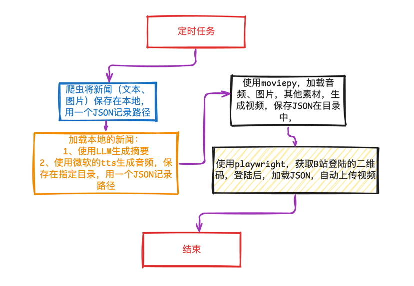

<p align="center">
  
  
  
  
  
</p>

# 📄 免责声明（Disclaimer）

> 本项目为开源性质，提供新闻数据爬取功能，仅供学习、研究和非商业用途。使用本代码进行任何操作前，请您务必仔细阅读以下免责声明：
> 1. 遵守法律法规 使用者应确保其行为符合所在国家/地区的相关法律法规，包括但不限于《网络安全法》《个人信息保护法》《著作权法》等相关法律规定。开发者不对因使用本项目而引发的任何法律责任负责。
> 2. 尊重网站规则 本项目仅为技术演示目的，爬取方式可能违反部分网站的服务条款或robots协议。请在使用前查阅目标网站的
     robots.txt ,文件及相关政策，并获得合法授权后再进行大规模抓取。如因爬虫行为导致IP被封禁、账号受限或其他后果，责任由使用者自行承担。
> 3. 数据使用风险 通过本项目获取的数据仅限于个人学习、测试或研究用途。禁止将数据用于非法传播、商业牟利、侵犯他人隐私等不当用途。开发者对使用者如何处理所爬取的数据概不负责。
> 4. 无商业支持与担保 本项目为免费开源项目，不提供任何形式的技术支持、维护或更新。代码可能存在缺陷、错误或兼容性问题，使用时需自行评估风险。
> 5. 不承担连带责任 开发者及贡献者不对由于使用本项目造成的任何直接或间接损失（包括但不限于数据丢失、服务中断、名誉损害等）承担责任。

# ❌风险预警

以下三个平台，均已注销账号

## 小红书

```text
账号审核详情
平台：今日快电 / 小红书号：xxxxx46420
处置结果：警告
存在问题：
根据《规则百科》，账号下存在违反相关政策或规定的内容：
在未获得官方认证的情况下，自行编写新闻稿件并发布的行为
在未获得官方认证的情况下，以新闻形式进行内容发布的行为
在未获得官方认证的情况下，批量转载新闻信息的行为
其他违反平台规则的内容
```

## 快手

**已封号**

## 抖音

```
处置项目：
限制历史作品仅自己可见（15天）
处置周期：2025-07-10 09:42 至 2025-07-25 09:42
禁止修改个人资料（15天）
处置周期：2025-07-10 09:42 至 2025-07-25 09:42
重置个人资料
处置时间：2025-07-10 09:42（不具有持续效应）

存在问题：仿冒新闻媒体账号
账号可能存在“仿冒新闻媒体”的行为，包括但不限于：
账号个人资料中假冒、仿冒或捏造新闻媒体的名称和标识，或使用具有新闻属性的名称、标识
账号未经许可大量发布社会热点、国内外时政和本地新闻等新闻信息

改进建议：
立即修改账号昵称、头像等个人资料，停止使用与新闻机构或节目近似的名称和标识
删除账号内已有违规新闻内容
```

# ✅ 技术方案

大概的方向就是先使用爬虫技术，爬取网站的新闻文本、图片，英文新闻使用机器翻译进行翻译，使用ollama中deepseek进行翻译，摘要提取，
上述的素材准备好，使用moviepy生成视频。主要用的技术：

- 爬虫：BeautifulSoup
- 机器翻译：~~字节旗下的[火山翻译](https://www.volcengine.com/docs/4640/65067)~~（每月有免费额度，不够用已移除）使用Deepseek翻译
- 摘要提取：ollama 部署了  [deepseek-r1:8b](https://ollama.com/library/deepseek-r1 "点击打开ollama")
- 文字转语音:~~[字节的megaTTS](https://github.com/bytedance/MegaTTS3)~~，8G的GTX1080显存不够，使用微软的edge-tts，效果还可以。
- 视频生成：moviepy

> 硬件最好是有GPU，用来运行ollama，当然可以用云服务器或AI服务提供商代替，取决于个人的资源。

<p align="center">
  
</p>

## [crawl_news.py](crawl_news.py)

主要用以抓取几个新闻网址的新闻内容，每天定时任务执行4次，早、中、晚、夜。会把爬取的文件`news_results.json`存放如下：

- 主要使用的框架是`from bs4 import BeautifulSoup`

```text
├── 20250709
│   ├── bbc0
│   │   ├── 05
│   │   │   ├── 0a6d77f0-5664-11f0-960d-e9f1088a89fe.png
│   │   │   ├── 2a31d540-5be6-11f0-a40e-a1af2950b220.png
│   │   │   ├── 3cbc1490-5665-11f0-960d-e9f1088a89fe.png
│   │   │   ├── 44c481e0-5665-11f0-960d-e9f1088a89fe.png
│   │   │   ├── 57920b80-5665-11f0-9074-8989d8c97d87.png
│   │   │   ├── 5e81dce0-5665-11f0-960d-e9f1088a89fe.png
│   │   │   ├── 81079dc0-5bdf-11f0-960d-e9f1088a89fe.png
│   │   │   ├── 84b897d0-5bdf-11f0-960d-e9f1088a89fe.png
│   │   │   └── b08afdb0-5be6-11f0-a40e-a1af2950b220.png
│   │   ├── 06
│   │   │   └── 84339410-5c05-11f0-9d64-1b7197dd7c07.jpg
│   │   ├── 08
│   │   │   ├── 0b5f2290-58e3-11f0-b5c5-012c5796682d.jpg
│   │   │   ├── 300dcf70-58e2-11f0-960d-e9f1088a89fe.jpg
│   │   │   ├── 3885a070-581e-11f0-960d-e9f1088a89fe.jpg
│   │   │   ├── 5b49e5a0-5821-11f0-b5c5-012c5796682d.jpg
│   │   │   ├── 62c8cd00-58e4-11f0-b5c5-012c5796682d.jpg
│   │   │   └── eae1ea60-58e3-11f0-b5c5-012c5796682d.jpg
│   │   └── news_results.json
│   ├── c_en0
│   │   ├── 10
│   │   │   ├── 686e2ce9a31000e98c7d7c1b.jpeg
│   │   │   ├── 686e2ce9a31000e98c7d7c1d.jpeg
│   │   │   └── 686e2ce9a31000e98c7d7c1f.jpeg
│   │   ├── 11
│   │   │   └── 686d9aa9a31000e98c7d68df.jpeg
│   │   ├── 12
│   │   │   └── 686e081aa31000e98c7d757b.gif
│   │   ├── 13
│   │   │   └── 686e5b20a31000e98c7d7e2b.jpeg
│   │   └── news_results.json
│   ├── rlj0
│   │   ├── 06
│   │   │   └── AFP__20250708__66884GK__v3__HighRes__BritainFranceRoyalsDiplomacy-1752028160.jpg
│   │   ├── 07
│   │   │   └── AP25190083362645-1752031483.jpg
│   │   ├── 08
│   │   │   ├── AFP__20250707__662999A__v6__HighRes__MultipleDeathsFromCatastrophicFloodingInCentral-1752044877.jpg
│   │   │   ├── AFP__20250707__662B6JY__v1__HighRes__MultipleDeathsFromCatastrophicFloodingInCentral-1752044813.jpg
│   │   │   ├── AFP__20250708__2223487921__v3__HighRes__DeathTollRisesAfterFlashFloodsInTexasHillCou-1752045110.jpg
│   │   │   ├── AFP__20250708__668C9XV__v1__HighRes__MultipleDeathsFromCatastrophicFloodingInCentral-1752044908.jpg
│   │   │   ├── AFP__20250708__668C9XZ__v1__HighRes__MultipleDeathsFromCatastrophicFloodingInCentral-1752044936.jpg
│   │   │   ├── AFP__20250708__668C9Y7__v2__HighRes__MultipleDeathsFromCatastrophicFloodingInCentral-1752044979.jpg
│   │   │   ├── AFP__20250708__668C9YC__v1__HighRes__MultipleDeathsFromCatastrophicFloodingInCentral-1752045013.jpg
│   │   │   ├── AFP__20250708__668C9YM__v1__HighRes__MultipleDeathsFromCatastrophicFloodingInCentral-1752045056.jpg
│   │   │   ├── AFP__20250708__668C9YN__v1__HighRes__MultipleDeathsFromCatastrophicFloodingInCentral-1752045088.jpg
│   │   │   └── AP25190135889726-1752045130.jpg
│   │   └── news_results.json
│   └── rt0
│       ├── 01
│       │   └── 686bd2e020302712b375521e.jpg
│       └── news_results.json
└── end.mp3
```

## [video_generator.py](video_generator.py)

使用`moviepy`生成视频

## [upload.py](upload.py)

使用`实现自动`实现B站自动登陆，以及自动上传

## [ollama_client.py](ollama_client.py)

使用··生成新闻的摘要

## [logging_config.py](logging_config.py)

打印日志的配置

## [utils.py](utils.py)

日期、文件路径、音频等工具类

# 🧠 新闻来源

- [x] 中国日报（chinadaily）
- [x] 英国广播公司（BBC）
- [ ] 英国卫报（The Guardian）https://www.theguardian.com/us
- [ ] 泰晤士报（The Times） https://www.thetimes.com/
- [x] 今日俄罗斯 https://www.rt.com/
- [x] 中东半岛新闻 https://www.aljazeera.com/

英国卫报、泰晤士报、彭博社报和BBC的内容差不多，不再重复爬取。

# 📊 使用

在ubuntu 22.04 中，使用conda创建一个python3.11的环境，安装依赖包，然后运行crawl_news.py和video_generator.py。

> 要先使用python crawl_news.py，下载好的数据，再调用video_generator.py生成视频。

```shell
source activate py311
python crawl_news.py
python video_generator.py
python crawl_news.py 
python vedio_generator.py 
```

# 🔮 效果

- https://space.bilibili.com/372736088 每日生成的视频

以下生成的视频截图


# 🧭测试

功能可用，在摘要生成时，以下的nvidia 1080 8G 显卡，在运行ollama deepseek-r1:8b进行摘要生成的情况：


# 📌 todo

- [x] 英文翻译成中文
- [x] ollama进行摘要提取
- [ ] ~~ollama进行摘要提取后，增加一个小的评论~~
- [x] 信息的过滤，对于政治类的信息，中英文的都要去除
- [ ] ~~照片去重~~
- [x] 晚间新闻
- [x] 重试入口
- [x] 内容过滤
- [x] 时长过多，要精简
- [x] 片头优化
- [x] china daily 英文版
- [x] bbc 下线，因为爬虫被检测到，封禁了
- [x] ~~china daily asis 版~~
- [ ] 背景音乐
- [ ] 视频爬取
- [ ] 自动上传B站:制定一个APP，~~可以上传多平台~~
- [x] multiple threading : is edge-tts thread safety? No, It is not safety, meanwhile it is would be limited traffic.
- [x] multiple threading : is moviepy write_file thread safety? No, It is not safety, cause some global variates are
  shared .


